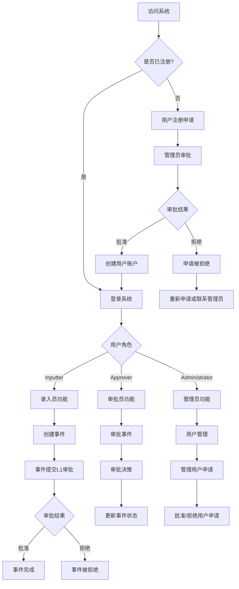
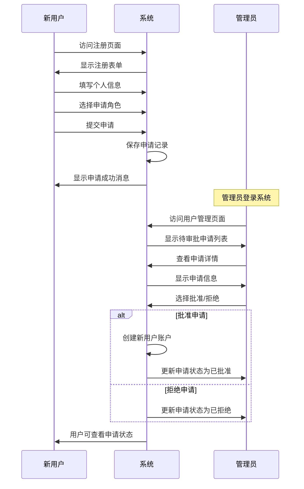
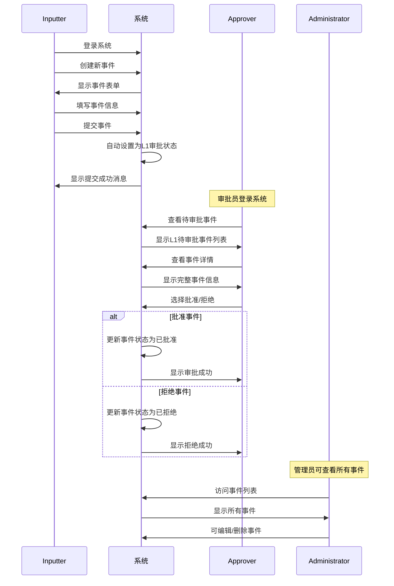
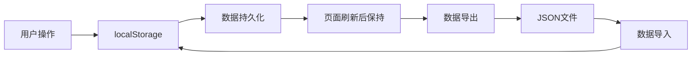

# LED风险管理系统使用流程图

## 系统整体流程图

## 用户注册流程

## 事件管理流程

## 审批流程详细说明

### L1审批流程
1. **Inputter创建事件**
   - 填写事件基本信息
   - 系统自动设置为"Pending Approval L1"状态
   - 事件提交到L1审批队列

2. **Approver审批**
   - 查看L1待审批事件列表
   - 点击查看事件详情
   - 选择批准或拒绝
   - 系统更新事件状态

3. **审批结果**
   - 批准：事件状态变为"Approved"
   - 拒绝：事件状态变为"Rejected"
   - 事件可在事件列表中查看

### 用户权限说明

#### Inputter (录入员)
- ✅ 创建新事件
- ✅ 编辑自己创建的事件
- ✅ 查看自己部门的事件
- ✅ 删除草稿状态的事件
- ❌ 审批事件
- ❌ 管理用户

#### Approver (审批员)
- ✅ 审批L1级别事件
- ✅ 查看自己部门的事件
- ✅ 管理IAM项目
- ❌ 创建事件
- ❌ 管理用户

#### Administrator (管理员)
- ✅ 查看所有事件
- ✅ 编辑任何事件
- ✅ 删除任何事件
- ✅ 审批所有级别申请
- ✅ 管理用户注册申请
- ✅ 管理所有用户
- ✅ 访问数据管理功能

## 数据流程

## 系统状态说明

### 事件状态
- **Draft**: 草稿状态（可编辑）
- **Pending Approval L1**: 等待L1审批
- **Pending Approval L2**: 等待L2审批（预留）
- **Approved**: 已批准
- **Rejected**: 已拒绝

### 用户申请状态
- **Pending**: 待审批
- **Approved**: 已批准
- **Rejected**: 已拒绝

### 用户状态
- **Active**: 活跃用户
- **Inactive**: 禁用用户

## 操作指南

### 新用户注册
1. 访问系统登录页面
2. 点击"申请注册"链接
3. 填写个人信息和申请理由
4. 提交申请
5. 等待管理员审批
6. 审批通过后使用员工ID登录

### 创建事件
1. 使用Inputter账户登录
2. 点击"新建事件"
3. 填写事件详细信息
4. 点击"保存草稿"
5. 系统自动提交L1审批

### 审批事件
1. 使用Approver账户登录
2. 在事件列表中查看待审批事件
3. 点击"查看详情"查看完整信息
4. 选择"批准"或"拒绝"
5. 系统更新事件状态

### 管理用户
1. 使用Administrator账户登录
2. 点击"用户管理"
3. 查看待审批申请列表
4. 点击"查看详情"查看申请信息
5. 选择"批准"或"拒绝"
6. 系统自动创建用户账户或更新申请状态

## 注意事项

1. **数据存储**: 当前使用localStorage，数据仅保存在用户浏览器中
2. **权限控制**: 不同角色有不同的操作权限
3. **审批流程**: 事件创建后自动进入审批流程
4. **用户管理**: 只有管理员可以审批用户注册申请
5. **数据导出**: 可通过数据管理功能导出/导入数据